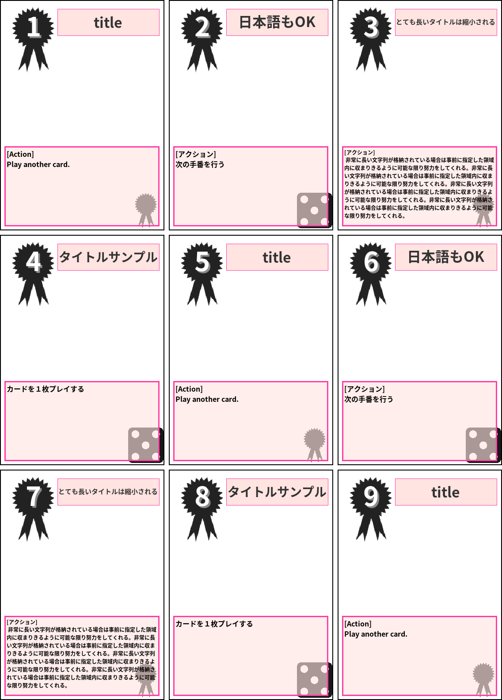
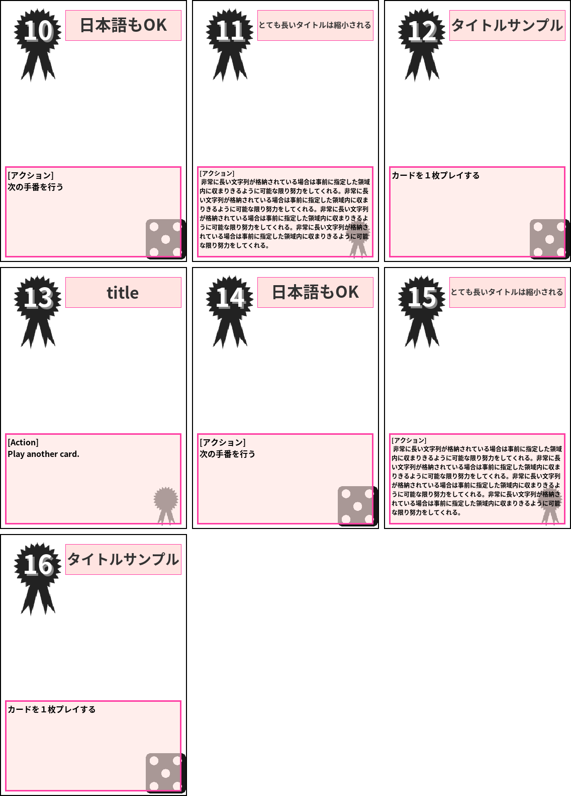

# Testplay Card Generator

[](https://travis-ci.org/a-hisame/testplay-card-generator)
[](https://codecov.io/gh/a-hisame/testplay-card-generator)
[](LICENSE)

```
Note: このプロジェクトは開発途中のαバージョンであり、ドキュメンテーション化が行われていません。
また、現時点の使い方は将来的に変更になる可能性があります。
```

もしカードゲームをプレイしたいとき、そのカードがないならばどうしますか？

特にあなたがボードゲームデザイナーであり、そのゲーム内で多くのカードを使う場合
それらのカードを実際に印刷してテストプレイをし、ゲームのバランスを調整したいと思うでしょう。

この目的のため、以下のことができるテストプレイ用のカードジェネレータがあれば便利だなと思っていました。

* 四角や丸、線などの基本的なコンポーネントを描画できる機能
* テキストを特定の範囲内に自動的に縮小して描画してくれる機能
* １つのレイアウトと複数行のExcelなどで管理されるデータを元に複数のカードを生成してくれる機能
* 作成したすべてのカードを印刷しやすいように(例えば、１つのPDFファイルに)まとめてくれる機能

そして、このプロジェクトではこれらの機能を提供してテストプレイ用のカードを自由自在に作ることができます。


## 具体例

このプロジェクトによって以下のようなイメージファイル、あるいはPDFファイルを生成できます。
これを生成するために [レイアウトYAMLファイル](layout-sample.yml) と [データCSVファイル](data-sample.csv) を利用しました。

* PNG Image





* [PDF file for print](output.pdf)


## インストール

ubuntu 18.04 上の Python 3.6.5 (virtualenv) で動作を確認しています。

### ただ使いたいだけなら

```
# only use and install
pip install git+https://github.com/a-hisame/testplay-card-generator.git
```

### 開発をしたいのであれば

```
# setup virtualenv if needed
virtualenv .venv
source .venv/bin/activate

# needs to install development tools additionally
python scripts/install.py requirements-dev.txt
```

## カード生成のための準備

あなたのカードの `レイアウトYAMLファイル` と `データCSVファイル` を用意する必要があります。

しかし、準備しなくてもプログラムが実際に動作するかを確かめるために
プロジェクトで提供されている [サンプルレイアウトYAMLファイル](layout-sample.yml) と
[サンプルデータCSVファイル](data-sample.csv) を利用できます。


## 利用方法

以下のコマンドによって印刷用ファイル `output.pdf` ファイルを生成することができます。

```
tcgen --layout <your layout file> --data <your data file> --output output.pdf
```

## レイアウトYAMLファイル

レイアウトファイルはカードにどのような描画を行うかを定義するファイルです。
[サンプルレイアウトYAMLファイル](layout-sample.yml) 内に記述のための細かい説明が記載されています。


## データCSVファイル

CSVファイルの１行が１枚のカードに相当します。
[サンプルデータCSVファイル](data-sample.csv) に書いてあるように、
１行目はヘッダ、２行目以降はカードの内容を記述することで自分に必要な
テストプレイのカードを作成することができます。


## LICENSE

このプロジェクトは [MIT LICENSE](LICENSE) です。

しかし、同梱物として以下の Noto Font を含んでおり、これらのフォントのライセンスは　SIL Open Font License 1.1 となります。

* [Noto Sans CJK JP Light](data/fonts/NotoSansCJKjp-Light.ttf) - https://www.google.com/get/noto/
* [Noto Sans CJK JP Bold](data/fonts/NotoSansCJKjp-Bold.ttf) - https://www.google.com/get/noto/
